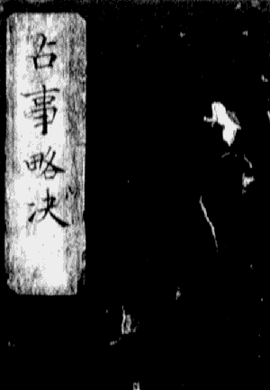
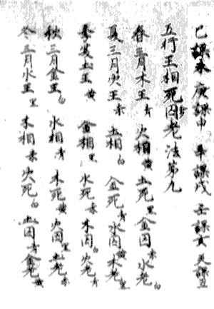
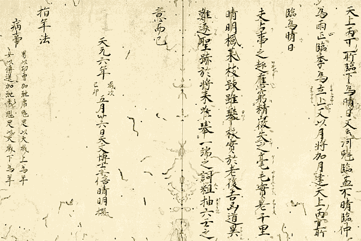
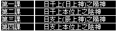
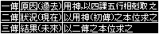
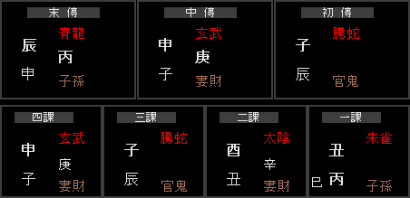
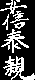
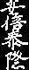

# 占事略決

> **著者**：天文博士 安倍晴明（921–1005）
> **底本**：阿部泰統抄本／陰陽道史總說錄（另参京都大學藏本）
> **註譯**：浦木裕（原文中〔浦木裕注〕引用块及「補註」均为其注解，仅供研究参考）
> **来源**：[久遠の絆 — 占事略決](https://miko.org/~uraki/kuon/furu/explain/meisi/onmyouji/senji/senjiryakuketu.htm)（2026-07-05 采集）
> **说明**：原文为漢文。〔〕内为底本小字夹注；*斜体* 为校勘记；> 引用块为浦木裕的旁注。原始 HTML 备份于 raw/ 目录。

---

## 目錄・總綱

〔〔包紙〕
甲第七古筆上〕　　　占事略決

土御門〈阿部泰統筆〉兵部少輔〔 泰福奧書〕 壹卷

〔〔本文〕〕
占事略决【天文博士安倍晴明著】

四課三傳法　　　　第一

課用九法　　　　　第二
天一治法　　　　　第三

十二將所主法　　　第四
十二月將所主法　　第五

十干罡柔法　　　　第六
十二支陰陽法　　　第七

課干支法　　　　　第八
五行王相等法　　　第九

所勝法　　　　　　第十

五行相生相剋法　　第十一
五行相刑法　　　　第十二

五行相破法　　　　第十三
日德法　　　　　　第十四

日財法　　　　　　第十五
日鬼法　　　　　　第十六

干支數法　　　　　第十七
五行數法　　　　　第十八

五行干支色法　　　第十九

十二客法　　　　　第廿
十二籌法　　　　　第廿一

一人問五事法　　　第廿二
知男女行年法　　　第廿三

空亡法　　　　　　第廿四
知吉凶期法　　　　第廿五

卅六卦所主大例法　第廿六
占病祟法　　　　　第廿七

占病死生法　　　　第廿八

占產期法　　　　　第廿九
占產男女法　　　　第卅

占待人法　　　　　第卅一
占盜失物得否法　　第卅二

占六畜迯亡法　　　第卅三
占聞事信否法　　　第卅四

占有雨否法　　　　第卅五
占晴法　　　　　　第卅六

## 卷第一、四課三傳法

　四課三傳法　第一

　常以月將加占時,視日辰陰陽,以立四課.

　日上神為日之陽.〔是謂-一課.〕日上神本位所得之神為日之陰.〔是謂-二課.〕辰上神為辰之陽.〔是謂-三課.*陽,異筆作-陰.*〕辰上神本位所得之神為辰之陰,〔是謂-四課.〕

　甲 乙 丙 丁 戊 己 庚 辛 壬 癸〈日月天地人民金石江河〉,是為日.子 丑 寅 卯 辰 巳 午 未 申 酉 戌 亥,是為辰也.

　四課之中,察其五行,取相剋者以為用.發用神為一傳,用神之本位所得二傳.二傳之神,本位所得神為三傳也.

> **〔浦木裕注〕**
>
> **月將**,太陽宮也.是為六壬學之樞幹.六壬神課,即以占時加月將,設天地盤(式盤)而卜吉凶之法.◎補註01
>
> 　**四課**,以當日干支為基造之,日辰也.將十二支配於辰而來.◎補註02
> 　**用神**,三傳之初傳.發用神.◎補註03
> 　**三傳**,由四課五行相剋取之.分屬過去、現在、未來之表徵.◎補註04

## 卷第二、課用九法

　課用九法　第二

　第一.若四課中,有下剋上者,當以為用.若無下剋上者,以上剋下為用.所以然者,下剋上為逆為深.臣殺君,子殺父,婦殺夫,婢殺主,故為深.上剋下者,為順為淺,君怒臣,父賊子,夫殺妻,主殺奴,故為淺也.

　第二.若有二三四〔*課*〕下剋上亦二三四〔*課*〕上剋下者,以與今日比者為用.罡日比日,神后、功曹、天罡、勝先、傳送、河魁.柔日比辰,大吉、大衝、太一、小吉、從魁、徵明也.

　第三.若四課俱比、俱不比,以涉害深者為用.〔*涉害,底本做涉客.*〕加孟為深,加中為半,加季為淺.寅申巳亥為孟,子午卯酉為仲,丑未辰戌為季.

　第四.若有涉害俱等者,〔*涉害,底本做涉客.*〕取先舉者為用.所謂先舉者,日為先,辰為後,陽為先,陰為後也.

　第五.若四課陰陽皆不相剋者,以遙相剋者為用.所謂今日神遙剋四課神,四課神遙剋今日神也.若今日神剋四課神,四課神剋今日神者,以神剋日為用.若日剋兩神,兩神剋日者,取比者為用.若俱比、俱不比者,以涉害深為用.〔*涉害,底本做涉客.*〕

　第六.若四課之中無上下相剋亦無遙相剋者,以昴星為用.〔昴星者,從魁是也.〕罡日仰視酉上所得神為用,柔日以從魁所臨下神為用.其三傳法異常也.罡日傳辰上,終日上.柔日傳日上,終辰上.

　第七.天地伏吟時,〔謂天神地各居其位.〕若有相剋者,當以為用.〔謂乙癸日.〕若無相剋者,罡日以日上神為用,柔日以辰上神為用.其三傳,用神為一傳,其刑神為二傳,其衝神為三傳也.〔形衝法在左也.〕

　第八.天地反吟時,〔謂天地神反其位,假令子神戌午上也.〕若有相剋者,當以為用.無相剋者,罡日以日之衝為用,柔日以辰之衝為用.〔丁丑、丁未、已丑、己未、辛丑、辛未是也.丁未、己未、辛未日,太一臨亥用.丁丑、己丑、辛丑日,徵明臨己用.〕其三傳法,傳辰上,終日上神.〔反吟時,三傳有異端.省而不載.〕

　第九.五柔日作用不同,〔謂五柔者,八專日別稱也.甲寅、庚申、己未、丁未、癸丑是也.〕若有相剋者,當以為用.〔其三傳如常.〕若無相剋者,罡日從日上神順數及三神為用,柔日從辰上神本位所得神逆數及三神為用.罡柔俱元三傳,終日辰上而已,若用起日辰上者,唯有一傳耳.

> **〔浦木裕注〕**
>
> **罡日**,陽日是也.罡,剛也.◎補註05
>
> 　**五柔**,八專課是也.雖亦名八專日,卻異於曆注所云八專日.◎補註06

## 卷第三、天一治法

　四天一治法　第三

　欲知諸將前後.以天一為首.天一在亥上,以子為前,以戌為後.天一在戌上,以酉為前,以亥為後.天一在辰上,以巳為前,以卯為後.〔*巳,底本作己.*〕天一在巳上,以辰為前,以午為後.〔*巳,底本作己.*〕常背天門向地戶.〔所向為前,所背為後.〕

　甲、戊、庚,旦治大吉,暮治小吉.乙、己,旦治神后,暮治傳送.丙、丁,旦治徵明,暮治從魁.六、辛,旦治勝先,暮治功曹.〔*京大本無六字.勝先,底本作勝光.*〕壬、癸,旦治太一,暮治大衝.

　旦暮治遙,從寅主酉為旦,從戌至丑為暮.

## 卷第四、十二將所主法

　十二將所主法　第四

　前一,騰虵.火神,家在巳,主驚恐怖畏,凶將.〔*騰虵,騰蛇也.*〕

　前二,朱雀.火神,家在午,主口舌懸官,凶將.

　前三,六合.木神,家在卯,主陰私和合,吉將.〔*六合,底本作六口.*〕

　前四,勾陣.土神,家在辰,主戰鬥諍訟,凶將.〔*勾陣,勾陳也.*〕

　前五,青龍.木神,家在寅,主錢財慶賀,吉將.

　天一,貴人.土神,家在丑,主福德之神,吉將.〔大無成.*土神,底本作上神.*〕

　後一,天后.水神,家在亥,主後宮婦女,吉將.

　後二,大陰.金神,家在酉,主弊匿隱藏,吉將.

　後三,玄武.水神,家在子,主亡遺盜賊,凶將.

　後四,大裳.土神,家在未,主冠帶衣服,吉將.

　後五,白虎.金神,家在申,主疾病*死*喪,凶將.

　後六,天空.土神,家在戌,主欺殆不信,凶將.

　前盡於五,後終六.天一立中央,為十二將定吉凶而斷事者也.

> **〔浦木裕注〕**
>
> **騰蛇**,十二將之一,火神.◎補註07

## 卷第五、十二月將所主法

　十二月將所主法　第五

　正月,徵明.水陰神,凶治在亥,為河神,主牢獄鬥訟事.〔*牢,底本作穿.*〕

　二月,河魁.土陽神,凶治在戌,為土神,主口舌婦人事.

　三月,從魁.金陰神,凶治在酉,為竈神,主移徙搖動事.〔*從魁,底本作徵魁.*〕

　四月,傳送.金陽神,吉治在申,為道路神,主遠行商賣事.

　五月,小吉.*土*陰神,吉治在未,為天井,主酒食廚膳事.

　六月,勝先.火陽神,吉治在午,為外竈神,主五榖口舌事.

　七月,太一.火陰神,凶治在巳,為內竈神,主船車相連事.

　八月,天罡.土陽神,凶治在辰,為土神,主疾病死喪事.

　九月,大衝.木陰神,凶治在卯,為社樹,主林木船車事.

　十月,功曹.木陽神,吉治在寅,為大樹,主徵召長史事.

　十一月,大吉.土陰神,吉治在丑,為山神,主六畜宮土事.

　十二月,神后,水陽神,吉治在子,為北辰,主婦女陰私事.

## 卷第六、十干罡柔法

　十干罡柔法　第六

　甲、丙、戊、庚、壬,為罡干,亦為陽干.

　乙、丁、己、辛、癸,為柔干,亦為陰干.

## 卷第七、十二支陰陽法

　十二支陰陽法　第七

　子、寅、辰、午、申、戌,為陽支,亦為罡支.

　丑、卯、巳、未、酉、亥,為陰支,亦為柔支.

## 卷第八、課干支法

　課干支法　第八

　甲,課寅.乙,課辰.丙,克巳.丁,課未.戊,課巳.己,課未.庚,課申.辛,課戌.壬,課亥.癸,課丑.

## 卷第九、五行王相等法

　五行王相死囚〈人〉老法　第九

　春三月.木王,〔青.〕火相,〔黃.〕土死,〔黑.〕金囚,〔赤.〕水老.〔白.〕

　夏三月.火王,〔赤.〕土相,〔白.〕金死,〔青.〕水囚,〔黃.〕木老.〔黑.〕

　季夏.土王,〔黃.〕金相,〔黑.〕水死,〔赤.〕木囚,〔白.〕火老.〔青.〕

　秋三月.金王,〔白.〕水相,〔青.〕木死,〔黃.〕火囚,〔黑.〕土老.〔赤.〕

　冬三月.水王,〔黑.〕木相,〔赤.〕火死,〔白.〕土囚,〔青.〕金老.〔黃.〕

> **〔浦木裕注〕**
>
> **王相**,五行交互作用,分作王、相、死、囚、老五態.◎補註08

## 卷第十、所勝法

　所勝法　第十

　王氣所勝,法憂懸官.

　相氣所勝,法憂錢財.

　死氣所勝,法憂死亡.

　囚氣所勝,法憂繫囚.

　老氣所勝,法憂疾病

## 卷十一、五行相生相剋法

　五行相生相剋法　第十一

　木生火　火生土　土生金　金生水　水生木

　木剋土　土剋水　水剋火　火剋金　金剋木

## 卷十二、五行相刑法

　五行相刑法　第十二

　子刑卯　卯刑子　寅刑巳　巳刑申　申刑寅

　丑刑戌　戌刑未　未刑丑　辰、午、酉、亥,各自刑神.

## 卷十三、五行相破法

　五行相破法　第十三

　子酉相破　寅亥相破　辰丑相破　午卯相破　申巳相破　戌未相破

## 卷十四、日德法

　日德法　第十四

　甲德自處　乙德在庚　丙德自處　丁德在壬　戊德自處

　己德在甲　庚德自處　辛德在丙　壬德自處　癸德在戊〔*癸德在戊,底本戊作戌.*〕

## 卷十五、日財法

　日財法　第十五

　木財土　火財金　土財水　金財木　水財火

## 卷十六、日鬼法

　日鬼法　第十六

　木鬼金　火鬼水　土鬼木　金鬼火　水鬼土

## 卷十七、干支數法

　干支數法　第十七

　甲己數九　乙庚數八　丙辛數七　丁壬數六　戊癸數五

　子午數九　丑未數八　寅申數七　卯酉數六　辰戌數五　巳亥數四

## 卷十八、五行數法

　五行數法　第十八

　水,生數一.〔成員六.〕　火,生數二.〔成員七.〕　木,生數三.〔成員八.〕

　金,生數四.〔成員九.〕　土,生數五.〔成員十.〕

## 卷十九、五行干支色法

　五行十干十二支色法　第十九

　寅、卯、甲、乙,木.色青,在東.

　巳、午、丙、丁,火.色赤,在南.

　丑、未、辰、戌、戊、己,土.色黃,在中.

　申、酉、庚、辛,金.色白,在西.

　亥、子、壬、癸,水.色黑,在北.〔*黑,底本作悉.*〕

## 卷二十、十二客法

　十二客法　第廿

　子、酉、寅、亥、辰、丑、午、卯、申、巳、戌、未.

　陰將臨時,前五後三.　陽將臨時,後三前五.

　假令.正月,徵明,陰將也.即徵明為一客,天罡為二客,大吉為三客等是也.

　二月,河魁,陽將也.即河魁為一客,小吉為二客,神后為三客等是也.

　又有范蠡十三人法.省,不載.

> **〔浦木裕注〕**
>
> 以本法所載十二客序、合十二將所主法,徵明,陰將,凶治在亥,為一客.以辰為二客,是天罡.丑為三客,是大吉.河魁,陽將,凶治在戌,為一客.以未、子別二、三客,別是小吉、神后.

## 卷廿一、十二籌法

　十二籌法　第廿一

　未、戌、巳、申、卯、午、丑、辰、亥、寅、酉、子.

　陰神發用,前三後五.　陽神發用,後三前五.

　假令.徵明發用,即徵明為一籌,功曹為二籌,從魁為三籌是也.

　河魁發用,即河魁為一籌,小吉為二籌,神后為三籌是也.

> **〔浦木裕注〕**
>
> 徵明、功曹、從魁,亥、寅、酉也.河魁、小吉、神后,戌、未、子也.

## 卷廿二、一人問五事法

　一人問五事法　第廿二

　第一,月將加時.　第二,大歲加時.

　第三,月建加時.　第四,行年加時.　第五,本命加時.

> **〔浦木裕注〕**
>
> **大歲**,太歲,其年干支.月建,其歲地支.行年,歿年.本命,生年.◎補註10

## 卷廿三、知男女行年法

　知男女行年法　第廿三

　男,以本命加大歲,功曹下為行年.

　女,以大歲加本命,傳送下為行年.

## 卷廿四、空亡法

　空亡法　第廿四　〔子午屬庚,丑未為辛.寅申屬戊,卯酉屬己,辰戌為丙,巳亥屬丁.〕

　　　　　　　　　〔*屬戊,底本作屬戌.屬己,底本作屬巳.巳亥,底本作己亥.〕*

　甲子旬,戌亥為空亡　甲寅荀,子丑〈癸亥〉為空亡　甲辰旬,寅卯〈癸丑〉為空亡

　甲午旬,辰巳〈癸卯〉為空亡　甲申旬,午未〈癸己〉為空亡　甲戌旬,申酉〈癸未〉為空亡

> **〔浦木裕注〕**
>
> **空亡**,支孤無干者是也.◎補註11

## 卷廿五、知吉凶期法

　知吉凶期法　第廿五

　常以河魁之所加為法.

　假令.河魁加子午.河魁,戌,數五,子午數九,相乘之,五、九-四十五,即以卌五日內為期.

　加丑未者.相乘之,五、八-卌,即以卌日內為期.他效此.

　月期者,以用神所主月謂之.

　假令,功曹起用,以正月、十月為期也.正月者,月建所主.十月者,將所主也.

　日期,以今日所愛為嘉期.假令,今日-甲乙日者,以壬癸丙丁日為善期.〔*善、嘉,蓋皆為喜.*〕

　以今日所惡為憂期.假令,今日-甲乙日,以庚辛日為憂期.

## 卷廿六、卅六卦大例所主法

　三十六卦大例所主法　第廿六

　

### 氣類物卦　第一

　謂,所生為氣,所死為物,同位為類.

　木生於亥,咸於卯,死葬於未.〔或疏.假令甲乙日占事,徵明起用為氣,功曹、大衝起,用為類,小吉起,用為物.他效此.〕火生於寅,盛於午,死葬於戌.土生於火位,王六月,死葬於辰.〔假令.戊己日占事,勝先起,用為氣大吉、小吉.河魁起,用為類.天罡起,用為物也.〕金生於巳,盛於酉,死葬於丑.水生申,盛於子,死葬於辰.

　是故,亥卯未為木位,寅午戌為火位,巳酉丑為金位,申子辰為水位.土無方位,寄治於丙丁.

　氣憂父母,類憂兄弟及己身,物憂妻子及下人.

　

### 新故卦　第二

　〔故,占病,舊病更發也.角遊云,地六丁亥馬,乘五神,凶三傳是也.訴百事,皆新物也.〕

　〔故,娶婦,皆是再嫁.或故,交通,今數取之.田宅器物,皆背本物也.發明神后為用,吉凶今日アリ*〈在今日〉*.〕

　謂,罡日用,在陽為新,在陰為故.有氣為新,無氣為故.〔*言心〈所指〉*,日辰上神為陽,本位上神為陰也.〕柔日,所生加之為新,所死加之為故.〔假令乙日,河魁臨日為新,大吉臨乙為故也.〕

　

### 元首卦　第三

　謂以一上剋下為用是也.占事皆以神將,論其憂喜.〔假令,正月甲子日寅時占是也.〕

　

### 重審卦　第四

　謂四課中,有上剋下、下剋上,以下剋上為用是也.

　以此占人,出軍行師,不利為主人.〔假令,二月乙巳日午時占星也.*午時,底本作干時.*〕

　

### 傍茹卦　第五

　〔又名-見機卦,又名-綴瑕,占盜賊有鄰.〕

　謂四課中,有二三四相剋、二三四俱比者,以涉害深者為用是也.〔*涉害,底本作涉客.*〕

　此時所作,稽留憂患難解,妊娠傷胎.〔假令,四月酉日卯時占是也.〕

　

### 蒿矢卦　第六

　〔為創物、報物、遠物.〕　徃來,始令終木,為不吉.

　謂四課陰陽中,有與今日遙相剋者為用是也.

　此時占事.神來剋,日禍從外來.日徃剋,神身行報仇.以神將論其吉凶.〔假令,正月甲戌日寅時占是也.〕

　

### 寅視卦　第七

　〔病者ハ大力ナレトモ〔*〈雖無大力〉〕*不死,占產男子也.〕

　謂四課陰陽中,無相剋亦無遙相剋,以昴星為用是也.〔*謂四課,底本作課四課.昴星,底本作昇日生.*〕

　以此占事.罡日,遠行,主涉關梁.男子恐死於外.柔日,伏藏,不欲見人,行者稽留,居者有憂.女子媱妷,深憂不解.〔假令,六月戊寅日寅時占是也.*戊寅,底本作伐寅.是也,底本作星也.*〕

　

### 伏吟卦　第八

　〔罡日,欲行中止.柔日,伏藏不起.凡凶力皆近.〕

　謂天地伏吟時也.

　以此占人,聞憂不憂,聞喜不悅.占生子,暗啞若盲聾.占病者不言.合者將離,居者將移.關梁杜塞,諸神各歸家.〔假令,十月甲子日寅時占是也.〕

　

### 反吟卦　第九

　〔甲辰日,功曹婦季背夫.罡日,男子不正不忠,同婦人姧邪反亂.柔日,女子不貞不潔,間私通男子為亂.〕

　謂天地反吟時也,占事必見死人.父有不孝之子,君有不順之臣.父無所親,君無所因,〔*因,底本做囙.*〕以謀害人,殃及其身.〔假令,今日庚寅,反吟占是也.*害人,底本做客人.是也,底本做星也.*〕

### 無婬卦　第十

〔*　婬,底本作媱.*〕

　謂陽不與陰合,陰不與陽親,三言相得,徃比焉是也.

　以此占人,法式不正,夫婦各有邪心.〔假令,十月甲子日干時占是也.*是也,底本做星也.*〕

　

### 狡童逃女卦　第十一

　〔又名-夫友天后疳醫封,亦名-天后厭醫.〕

　謂用起天后,終六合、玄武是也.

　占事,家無,逃女必有.亡婦親族,檢葬醫使不得見.〔六月戊戌日辰時,正月庚午日卯時占也.〕

　

### 惟薄不脩卦　第十二

　謂一神二神陰陽共焉.八專日〈井〉謂也.

　占事,有內亂、婬妷之事也.〔*婬,底本作媱.妷,或作佚.*〕

　

### 三交卦　第十三

　カラ□タルモノハユル*〔〈可捕者,依之〉*.占靈氣,有重存靈,無氣死靈.〕

　謂以大衝、從魁,〔*從魁,底本作從魅.*〕加今日日辰為用.將得六合、大陰.又以日辰,在四仲神.又,用起四仲傳,終亦四仲,是也.

　占事,家匿罪人之象也.〔假令,正月乙未卯時,正月十一日寅時占是也.〕

　

### 亂首卦　第十四

　謂罸日也.一者,徃臨辰,用起其上.〔正月辛巳未時占也.〕二者,以辰剋其日,用起日上.〔正月甲申日卯時占是也.〕

　占事,臣殺君,奴婢害主.當此時,不可舉兵.

　

### 龍戰卦　第十五

　〔水邊物也.別大力者也.貴將欲遷,小吏退.占氏人,不安其所.〕

　謂二八門與用俱起.卯酉日,用起卯酉上是也.欲行不得行,欲止不得止.

　占事,其人動搖不安,將分財離居也.

　

### 贅婿寓居卦　第十六

　〔*婿,底本作聟.*今日,辰來加今日,曰為用是也.〕

　謂今日之辰來加,日日徃賊辰,辰來受賊也.此,女提子而行嫁,復以其身託寄他人,不得自專之也.

　以此占人,皆有違逆、姧婬、內亂之事.〔*姧婬,底本作姧媱.*〕吉凶各以神將論之.〔假令,十月甲戌日午時占是也.〕

　

### 陰陽無親卦　第十七

　謂,陽無所依,陰無所親.禍生內外,將及身.

　以此謀事,必見死人,又*父*有不孝之子,君有不順之臣.父無所親,君無所因,〔*因,底本作囙.*〕天地反者也.

　一者,時運反吟,陰剋其陽.〔*時運,或本作時遇.*〕二者,時遇反吟,四課皆剋.〔正月壬午日巳時占.*壬午,底本作吉辛.*〕三者日辰上神,皆為其陰所賊.〔假令,正月庚子日巳時占也.〕

　

### 陞跎卦　第十八

　〔勵德也.〕

　謂天一之神,立二八門是也.〔正月辛亥日寅時占.〕

　若占遇之,有德君子則進上,姧虐小人則退下.〔*姧虐,底本作姧虛.*〕卑官失祿,高官遷職.此皆陰陽易位,天一在門,搖動不安之象也.

### 玄胎四牝卦　第十九

　謂用起四孟神,傳終在四孟是也.若占遇此卦者,其人始含經計,欲有建立.

　占事,是親善惡,以將云之.若無計謀,即妻妾將有子也.

　

### 聯茹卦　第廿

　〔又名-知一.陰日陰神為用,〔*用,底本作月.*〕陽日陽神為用也.從魁所在吉凶日,陽神為用也.〕

　謂用起神,與今日比是也.〔五月辛亥日卯時占也.〕亦雖用神不比,以日辰上神及傳,終與日比是也.

　若將射彼物,或人人欲知何求,皆以此卦決之.

　

### 曲直卦　第廿一

　謂亥、卯、未,木之位.若用傳終,皆遇之.

　是若占遇此者,其人欲有伐木、剋木之事.〔五月丁卯日卯時占也.〕

　

### 炎上卦　第廿二

　〔離別.〕

　謂寅、午、戌,火之位.若用傳終,皆得此神.

　是若占遇此者,其人欲有炭灰、鑪冶之事.經曰:「若見三火,將得白虎.皆方為燒死事.」〔正月甲戌日未時占也.〕

　

### 稼穡卦　第廿三

　謂戊、己日,用起大吉、小吉,終太一、勝先.或用傳終,得四季土,及太一、勝先是也.

　若占遇之者,其人欲有耕農、土功之事.〔十一月癸丑日辰時占也.〕

　

### 從革卦　第廿四

　謂巳、酉、丑,金之位.若用傳終,皆遇其神是也.

　若占遇之者,其人將有兵革、金鐵之事.〔七月辛酉日酉時占也.〕

　

### 潤下卦　第廿五

　謂甲、子、辰,水之位.若用傳終,皆遇其神是也.

　若占遇之者,其人欲有溝渠、舟檝、釣網之事.〔八月庚辰日申時占也.〕

　

### 九醜卦　第廿六

　〔戊子午,壬子午,乙己辛卯酉日大吉,子午卯酉是也.〕

　謂天地之道,歸殃九醜.〔*殃,底本作殊.*〕乙戊己辛壬之日,子午卯酉之辰時加四仲大吉,臨日辰是.

　當此時,不可舉兵、嫁娶、遷移、築室、起土、遠行,為禍不出三年也.〔四月辛丑日辰時占也.〕

　

### 天網卦　第廿七

　〔*天網,底本作天細.*〕

　〔天網時,甲乙申酉,丙丁亥午,庚辛巳午,戊己寅卯,壬癸丑未辰戌,用是也.*天網,底本作天納.*〕

　謂時剋其日,用又助之是也.〔二月庚子日巳時占也.〕

　若占遇之者,所治事上下有憂.天網四張,萬物盡傷.以此占人,身死家亡也.〔*天網,底本作天納.*〕

### 無祿卦　第廿八

　〔男無妻,女無夫,六畜死散,從者離別.〔*死散,底本作死三.*〕〕

　謂四-上剋下,法曰-無祿也.若占遇之者,室空無人,人老必孤獨,群臣受殃,〔*殃,底本作殊.*〕妻子被殃.

　以此占人,上剋下,當此時,客勝主人為利.〔正月己巳日辰時占也.〕

　

### 絕紀卦　第廿九

　謂四-下剋上,法曰-絕紀也.若占遇之者,臣輕其君,子慢其父,妻害其夫,奴婢賊主,生男妨父,生女妨母,亡其先人.〔*奴婢,底本作好婢.*〕

　以此占人,皆無父母,臣事君、子事父為繼命.今下滅上,故為絕紀,故曰孤獨.當此時,利以居家,不宜為客.〔正月庚辰日辰時占也.〕

　

### 五憤四殺卦　第卅

　謂用傳皆得四季神也.

　若用傳與殺并合,又遇凶將者,〔*又,底本作文.*〕其人不殺害損殘人,即將自身受之.不與殺并合者,將有兵墓之事.〔六月乙未卯時占也.〕

　

### 三光三陽卦　第卅一

　謂日辰王相為一吉,用神主相為二吉,又得吉將為三吉.三吉並具,三光,主有喜事.

　用神在王相之中為一陽,日辰在天一前為二陽,天一順治之而行為三陽.

　三光既立,三陽又存.終亦有喜,重受其慶.〔六月戊辰日寅時,六月戊寅日寅時等占是也.〕

　以此占人,病者不死.舉尸入棺,猶復生.繫囚在獄,無徙刑.〔*囚,底本作囙.無,底本作天.*〕臨刀在頸,未足驚.所求者得,所訴者聽,沽市大利,所種者生.欲舉百事,無不成也.

　

### 高蓋駟馬*卦*　第卅二

　〔勝先三日,用是也.*勝先,底本作勝光.*〕

　謂用起天馬,傳見車乘,終於華蓋是也.又將得天后、青龍、天一、大裳,皆有公卿之象.〔*大裳,底本作太裳.*〕天馬者,〔正月在午,二月在申,三月在戌,四月在子,五月在寅,六月在辰.*申,底本作中.*〕訖,又始神后為華蓋,大衝為車乘.〔假令,正月癸酉日寅時占是也.*是也,底本作星也.*〕

　

### 斲輪織綬卦　第卅三

　〔大衝亦申用,但吉將得時也.*亦,底本作三.*〕

　課用起車乘,傳見印綬,將得婦女是也.踐公卿之位象,〔假令,二月庚戌日卯時,大衝加庚為用,大衝主車乘也,卯者而遇金.〕是斲輪之象也.〔*斲,底本作劉.*〕傳見河魁,主印綬來臨,卯是.綬在木之象也.將始大陰,中見六合,皆婦人所組織之象也.

　

### 鑄印乘軒卦　第卅四

　〔太一亦子用,但得吉將時也.〕

　謂用起太一,傳見河魁,終大衝,是其卦也.初見天子,終以恩私也.〔正月癸未日午時占是也.〕

　

### 斬關卦　第卅五

　〔魁罡用梁封.天罡、河魁、日辰、功曹,在三傳中是也.〕

　謂日辰踰魁罡,而及功曹,〔*及,底本作反.*〕二三並立門戶,關梁是.或以魁罡加辰卦,發功曹.〔正月乙巳日午時占也.〕或以魁罡加辰卦,發河魁,終功曹.〔正月庚寅日卯時是也.〕或以魁罡加日辰,三天俱動.〔今日,庚寅日占.〕或以魁加辰,及罡加日.〔今日,甲午魁加申.今日,庚午魁加庚是也.〕

　以此占人,其人即不迯亡,當越關梁之象也.

　

### 天獄卦　第卅六

　謂用在囚、死,斗繫其日本.占事,在家憂繫囚,重遇戮辱.雖遇吉將,不能為救.〔正月庚寅日,二月乙酉日,申時占、巳時占是也.〕

　右三十六卦,及九用次第,家家之說各不同.又有卅五卦、六十四卦法.或一卦之下,管載數名.或一卦之內,舉多說.然而事繁多煩,省而不載.具存本經,以智可覽之.

> **〔浦木裕注〕**
>
> **謂四**,謂四課之略也.
>
> 　**本經**,總指安倍晴明撰寫『占事略決』時所參考之中國占書.◎補註12

## 卷廿七、占病祟法

　占病祟法　第廿七

　〔『妙』云.病者,死期以月將.若大歲上神為白虎,不生歲中也.月建上神為白虎,不出月中也.〔*月建,底本作月運.*〕日上神為白虎,不日中也.不出,只此時死也.終得白虎與魁、罡并者,必死.〕

　謂占祟之大躰,以日辰陰陽中凶將言之.神吉將凶,為有祟神.神凶將吉,為有祟鬼.各以神將分別吉凶.又,有氣為神所作,無氣為鬼所作.

　用將俱木,主社神.用將俱火,主竈神.用將俱土,主土公及大歲神.上下俱金,主道路神.上下俱水,主水神.

　功曹、大衝,主氏神.〔又風病.〕太一、勝先,主竈神.傳送、從魁,主儛神,或以馬嗣神.徵明、神后、大衝、天罡,主北辰.天罡主水邊土公.小吉主門背土公及廚膳.河魁主竈土及兵墓土公.大吉主山神、大歲土公,又小澤土公.〔*又,底本作文.*〕從魁、太一、神后主詛咒.太一主毒藥及佛法.傳送主形象.騰虵主竈神、客死鬼.〔*客死鬼,底本作害死鬼.*〕朱雀主竈神及詛咒、惡鬼.六合主束縛死鬼、求食鬼.〔*縛死鬼,底本作傳死鬼.*〕勾陳主土公、廢竈神.青龍主社神及風病、宿食物誤.天后主母鬼及水上神.大陰主廁鬼.玄武主溺死鬼、乳死鬼.大裳主丈人.〔*丈人,底本作文人.*或書曰,丈人,父母也,靈氣也.〕白虎主兵死鬼、道路鬼.天空主無後鬼.餘以余神將所主決之.

## 卷廿八、占病死生法

　占病死生法　第廿八

　『大橈』云,〔*大橈,底本作大概.*〕傳用人死虛實,正日時日上神有氣,傳不是.白虎者不死,日上神無氣.見白虎必死,有實也.

　又云,日辰陰陽有白虎,宜用,秘為死氣,所勝亦死也.〔*宜用,底本作冝用.*〕辰上神剋日上神皆信,日上神剋辰上神為虛之.辰上神與日上神相可信明,與日上神相生,為和合神可信也.若刻罡三日,辰及年,其言不可信也.

　又云.正日上時,勝日上神為信,時勝.從上刻,不可信之.大陰天主之日辰,所言無任也.物類昆者,不信也.

　謂,日為身,辰為病,若病剋身重,深刻病輕.〔*若,底本作君.*〕白虎剋日重,日剋白虎輕.又云,〔*又,底本作文.*〕常以月將加時,若大吉、小吉、天魁、從魁、徵明與白虎并加病者,行年及日辰皆死.

　又以大吉加初得病日,視行年上,得天罡、從魁,十死一生也.因死之神,〔*因,底本作囙.*〕各騰虵、白虎、魁罡,加得病之日,是為三死.加病者,行年又死也.

## 卷廿九、占產期法

　占產期法　第廿九

　〔男以功曹有下為胎月,以本命為生月.女以傳送下為胎月,本命下為生月.〕

　謂以月將加時,視勝先.若加婦人年命,即日產.〔*婦人,底本作歸人.*〕隨勝先所在為產時.

　又云,欲知生時,視魁罡所加為生月.生月所加辰,即生日也.

## 卷三十、占產男女法

　占產男女法　第卅

　謂,用在上剋下為男.在下剋上為女.

　一云,天一加孟為男.加仲、季為女.

　一云,用得青龍、大裳為男.得天后,大陰、騰虵為女.

　又法,傳送加本命,行年上見陽神生男,見陰神生女.

　又云,年上有功曹生男,有傳送生女.

> **〔浦木裕注〕**
>
> 得天后,大陰、騰虵為女：天后得大陰、騰虵為女.

## 卷卅一、占待人法

　占待人法　第卅一

　〔『集』:天罡加子午,以庚日至.加丑未,以辛至.加寅申,以戊日至.加卯酉,以巳日至.〔*以上至字,底本皆作主字.*〕加辰戌,以丙至.加己,以丁日至之也.〔*丁日,底本作十日.*〕〕

　謂遊神加孟為始發,加仲半道,加季為既至.〔『神樞』云,以土時加大歲、魁罡為至日也.〕

　一云,東南行人以子上神為至期,西北行人以午上神為至期.

　遊神.春,太一.夏,神后.秋,從魁.冬,天罡.

　又云,用神在天一前為疾,在天一後為遲.來期,魁罡下為至期之.〔常視日辰上神得徵明.巳時至,以所見神衝為逐至期之也.〕

## 卷卅二、占盜失物得否法

　占盜失物得否法　第卅二

　〔『集靈』云:天罡加孟,內人男子未出,可得之.天罡加仲,男女共取得也.天罡加季,外女取也,出不可得也.〕

　謂以月將加時,天一及日辰制,所失物類得.制玄武,又得.

　日徃剋辰之陽神,所失物不可得.辰之陰神來,剋日之陽神,所失物得也.

## 卷卅三、占六畜迯亡法

　占六畜逃亡法　第卅三

　謂日辰上神制騰虵、玄武及物類神者,即得.不制者,不得.

　日辰上神,但制騰虵、玄武,而不制物類神者,不得.

　又,制物類神,而不制騰虵、玄武者,又不得.

　一云.魁罡加孟,得.加仲,半得.加季,不得.

　欲知得期,其物類神所在之鄉,日辰為期.欲知其方,以其物類神所在之鄉及其衝,為所在方.〔假令.馬責勝先下.牛責大吉下.〔*牛,底本作午.*〕鷹責從魁、小吉下是也.他效此.〕

## 卷卅四、占聞事信否法

　占聞事信否法　第卅四　〔直陰〕

　謂常以月將加時.大神加孟,不可信.加仲,半可信.加季,可信之.

　大神.春,大吉.夏,神后.秋,徵明.冬,河魁.

## 卷卅五、占有雨否法

　占有雨否法　第卅五

　〔直陰.而雨從龍,風從白虎.占時,青龍、白虎所乘神有氣,則有風雨.青龍、白虎與雷電並者,大雨也.卯為雷,子為靈也.〕

　謂常以月將加時,日辰上見神后、徵明、大衝,有雨.

　一云,日辰上見亥子,有雨.見寅卯,有多風小雨.巳午,無雨.見申酉,連陰,雨少.

## 卷卅六、占晴法

　占晴法　第卅六

　謂以月將加時,視神后、徵明、勝先、太一所臨.在天一後二,俱陰,在後四己除〈晴〉.傳送在天一前二四者,為大風己除〈晴〉.

　又云,功曹為青龍,傳送為白虎者,晴.

　又云,上丙丁所臨下為晴日.河魁臨孟不晴,臨仲為雨止,臨季為立止.

　又以月將加月建,天上丙丁所臨為晴日.

> **〔浦木裕注〕**
>
> **六壬**,即六壬神課是也.◎補註13

## 占事略決、跋

　夫占事之趣,應窮精徵.〔*占事,底本作古事.*〕失之毫毛,實差千里.

　晴明,楓葉枝疏,雖舉核實,於老後,吉凶道異,難逐聖跡.於將來,唯舉一端之詞,粗抽六壬之意而已.

*安倍朝臣晴明 撰*

【奧書】

*天元六年 歲次乙卯 五月廿六日　天文博士 安倍晴明撰

凡六壬占七百廿也　水火木金土〈一二三四五〉
以上三行,不存於阿部泰統抄本.依京大藏本奥書補之.*

　　貞應六年五月七日　　　　　　　*阿部泰統*　書寫之畢　

　　凡六壬占七百廿也　水火木金土〈一二三四五〉　*六壬,底本作六甲.*

　右之一卷,安倍泰統直翰無疑

　雖為歷代之家藏 〔今依所望之〕

　子細呈之為後來贅禿筆

　於其終矣

　　延寶八〔庚申〕六月廿八日　　　　　安倍

*皇紀二六六四年太歲甲申 浦木裕入力/初校畢了
皇紀二六六五年太歲乙酉十一月己未朔戊寅 浦木裕 二校畢了*

## 編譯後記（浦木裕）

　　

占事略決抄本 / 五行王相死囚老法　京都府立總合資料館藏

占事略決抄本 / 占事略決跋　京都大學附屬圖書館藏

安倍晴明著.漢文.時間不明,有皇紀一六三九年說.(依[京大藏本](https://rmda.kulib.kyoto-u.ac.jp/item/rb00008037)奧書有己卯年云云)

天元六年者,皇紀一六四四年,與已卯年(一六三九年)有所出入,且最古藏本無此句,是取信難.

假託晴明所著陰陽道典籍,所在多有.然僅此實為現存晴明著作而已.(簠簋內傳,實為鎌倉時代以降所成立.)

全書多用六壬神課(六壬式,玄女式),即以時刻為元,占天羅萬象事象之占法.

http://applepig.idv.tw/kuon/furu/explain/meisi/onmyouji/senji/senjiryakuketu.htm

主要底本:尊經閣文庫阿部泰統抄本『占事略决』　電子TEXT作成：浦木裕

## 補註（浦木裕）

### ０１【月將】

　月將者，太陽宮也。是即太陽移動而合月之十二位置，為六壬學〔玄女式〕之樞幹。行六壬占時，須用占時與月將，設造六壬式占之天地盤，再以四課三傳造式，而斷大小吉凶。是以，六壬神課之占，非備妥式盤〔天地盤〕不可。十二月將，依序為：徵明、河魁、徵魁、傳送、小吉、勝先、太一、天罡、大衝、功曹、大吉、神后。詳見十二月將所主法。

### ０２【四課】

　四課，所謂日辰是也。以其日干支為基礎而造之，將十二支配於辰而來。第一課為日干上〔日上神〕之陽神，第二課為日干上之本位上之陰神，第三課為日支上〔辰上神〕之陽神，第四課為日支上之本位上之陰神。

### ０３【用神】

　用神者，三傳中之初傳，發用之神是也。

### ０４【三傳】

　三傳，初傳（一傳）、中傳（二傳）、末傳（三傳）也。四課既立，各察其五行，擇一相剋者為用，即是一傳。以此用神為元而導出者，為二傳。再此二傳導出者，為三傳。一傳為物事之原因（過去），二傳為過程之狀況（現在），三傳為其結果之表徵（未來）。藉操作式盤三次，導其各自之三傳。

### ０５【罡日】

　罡日，剛日也，屬陽。柔日，屬陰。罡、柔，陰、陽，各自相對。是以罡日即陽日、柔日即陰日。

### ０６【五柔】

　五柔日者，亦名八專日，卻與曆注之八專日有些許相異，數亦不合。五柔日同於卅六卦大例所主法之惟薄不脩卦所謂之八專日者，相異於曆注之八專日，乃指六壬占式之八專課而言。

### ０７【騰蛇】

　騰蛇，十二天將之一，火神，在巳，主驚恐怖畏，凶將。於諸神方位之中，北玄武、南朱雀、東青龍、西百虎，勾陳、騰蛇居中。於奇門遁甲八神中，稟南方之火，為虛轉之神，掌虛偽、巧詐。十二天將，有騰蛇、朱雀、六合、勾陳、青龍、貴人、天后、大陰、玄武、大裳、白虎、天空。占事略決稱十二天將為十二將。民間則盛傳此為晴明所使役之十二神將。

### ０８【王相】

　五行王相死囚老法，此法將四季、五行之交互作用關係分作「王氣（旺氣）、相氣、死氣、囚氣、老氣」五態。春三月者，指二月寅、三月卯、四月辰。夏三月者，指五月巳、六月午、七月未。季夏者，土用，罰也。秋三月者，指八月申、九月酉、十月戌。冬三月者，指十一月亥、十二月子、一月丑。

| ＼ | 春 | 夏 | 罰 | 秋 | 冬 | 作用 | 解釋 |
|---|---|---|---|---|---|---|---|
| 旺 | 木 | 火 | 土 | 金 | 水 | 比和：和氣 | 良好 |
| 相 | 火 | 土 | 金 | 水 | 木 | 相生：生氣 | 散財 |
| 死 | 土 | 金 | 水 | 木 | 火 | 相剋：死氣 | 死亡 |
| 囚 | 金 | 水 | 木 | 火 | 土 | 相剋：殺氣 | 刑囚 |
| 老 | 水 | 木 | 火 | 土 | 金 | 相生：退氣 | 患病 |

### ０９【土用】

　土用，季節變換之刻。基於五行思想，春以木氣、夏以火氣、秋以金氣、冬以水氣。土氣則用在季節變換之刻，稱之土用。據平氣法（亦名恒氣法。起自冬至，將一太陽年之日數作廿四等分而導出。約在每別十五日之分點，交配節氣與中氣。是以，固定十一月冬至為起點，則各月之中必含中氣。如有不含中氣之月，則為閏月。），各為立春、立夏、立秋、立冬前十八日。春之土用為巳、午、酉日 ，夏之土用為卯、辰、申日 ，秋之土用為未、酉、亥日 ，冬之土用為卯、巳、寅日 。

### １０【太歲】

　大歲，太歲也，其年干支。太歲星者，或指木星，實為與木星（歲星）反向運行之太歲星（太歲與北斗星斗柄轉向同相而行，歲星則反相而行。），每十二年運行一周天，按子、丑、寅、卯之順序運行。實為古人所虛構之天體，作為計年之用。月建者，其月之地支。行年者，其人之歿年。本命者，其人之生年。月將加時者，則已述於前項。

### １１【空亡】

　空亡，以六十干支相配，而不含干者，謂之空亡。（天干數十、地支數十二，是以每配一旬，必漏二支，以為空亡。）用作判斷吉凶之指標。五行大義云：「以支孤無干，故名為空亡。亡者，無也，無干故亡。所對者全虛，故云空也。」乃物事現象止而不動，虛無空亡之狀態。各旬空亡，見於空亡法。下為日干支與空亡表，其中一至卅與六十一至九十之干支重疊。

| 01/61 | 02/62 | 03/63 | 04/64 | 05/65 | 06/66 | 07/67 | 08/68 | 09/69 | 10/70 | 空亡 |
|---|---|---|---|---|---|---|---|---|---|---|
| 甲子 | 乙丑 | 丙寅 | 丁卯 | 戊辰 | 己巳 | 庚午 | 辛未 | 壬申 | 癸酉 | 戌亥 |
| 11/71 | 12/72 | 13/73 | 14/74 | 15/75 | 16/76 | 17/77 | 18/78 | 19/79 | 20/80 | 空亡 |
| 甲戌 | 乙亥 | 丙子 | 丁丑 | 戊寅 | 己卯 | 庚辰 | 辛巳 | 壬午 | 癸未 | 申酉 |
| 21/81 | 22/82 | 23/83 | 24/84 | 25/85 | 26/86 | 27/87 | 28/88 | 29/89 | 30/90 | 空亡 |
| 甲申 | 乙酉 | 丙戌 | 丁亥 | 戊子 | 己丑 | 庚寅 | 辛卯 | 壬辰 | 癸巳 | 午未 |
| 31 | 32 | 33 | 34 | 35 | 36 | 37 | 38 | 39 | 40 | 空亡 |
| 甲午 | 乙未 | 丙申 | 丁酉 | 戊戌 | 己亥 | 庚子 | 辛丑 | 壬寅 | 癸卯 | 辰巳 |
| 41 | 42 | 43 | 44 | 45 | 46 | 47 | 48 | 49 | 50 | 空亡 |
| 甲辰 | 乙巳 | 丙午 | 丁未 | 戊申 | 己酉 | 庚戌 | 辛亥 | 壬子 | 癸丑 | 寅卯 |
| 51 | 52 | 53 | 54 | 55 | 56 | 57 | 58 | 59 | 60 | 空亡 |
| 甲寅 | 乙卯 | 丙辰 | 丁巳 | 戊午 | 己未 | 庚申 | 辛酉 | 壬戌 | 癸亥 | 子丑 |

### １２【本經】

　本經者，安倍晴明於撰寫『占事略決』之時，所參考之中國占術書籍之總稱。包括『五行大義』『黃帝金匱經』『大橈經』『集靈金匱經』『神樞靈轄經』『金烏玉兔集』等等。又，天平寶字元年十一月乙亥，孝謙天皇敕定各職必知曉經典之中，屬陰陽寮者包括：天文生，『天官書』『漢晉天文志』『三色薄讚』『韓楊要集』；陰陽生，『周易』『新撰陰陽書』『黃帝金匱』『五行大義』；曆算生，『漢晉律曆志』『大衍曆議』『九章』『六章』『周髀』『定天論』等。

### １３【六壬】

　天一生水，天五生土。「一」、「五」相合，而為「六」。壬者，「ノ」為水流之貌，以「ノ」、「土」相併，即成「壬」字。又，壬字，以「│」縱貫天地，以「─」釋宇宙之形。水、土，為萬物之元，合其道理，則生六壬。所謂六壬神課者，以日為基，合其占時、月將，配上該日干支，造天地盤，組織四課三傳，以為神占，遂定吉凶焉。

六壬神課式盤用例

### １４【指年】

　指年法，[京都大學藏本](https://rmda.kulib.kyoto-u.ac.jp/item/rb00008037)『占事略決』奧書所載，不見於他本。遂，不錄正文，轉錄於此。

指年法　京大藏本奧書所載

**病事**

　男以功曹加虵虎、魁罡,以大歲上為年.

　女以傳送加虵虎、魁罡,以大歲下為年.

**口舌**

　男以功曹加朱雀、勾陳,以大歲上為年.

　女以傳送加朱雀、勾陳,以大歲下為年.

**慶賀**

　男以功曹加青龍、大裳,以大歲上為年.

　女以傳送加青龍、大裳,以大歲下為年.

**上、中、下**

　天罡,加孟為上,加仲為中,加季為下.

　　保元元年　〔歲次丙子〕　十二月廿四日　戌時　以家說受息男

　　　　　　　　　　　　　　　　　　　　　　　　親長了

　　　　　　　　　　　　　　　　　　　　　　　　雅樂頭　安倍泰親　〔生年卅七〕

　　安貞三年　〔歲次己丑〕　十月十日　〔甲辰〕　以家秘本奉自　書寫畢

　　　　　　　　　　　　　　　　　　　　　　　　內藏助　安倍泰隆

　　　　　　　　　　　　　　　　　　　　　　　　即能、加點校合畢

